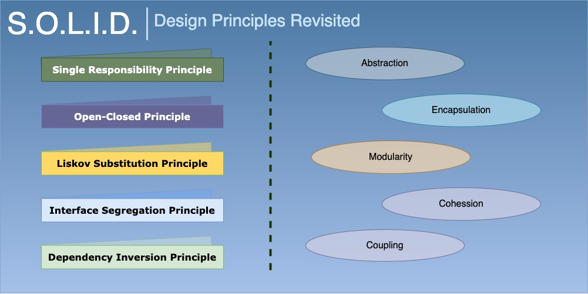
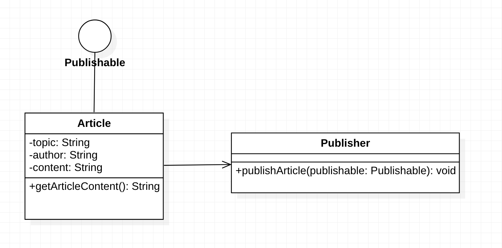
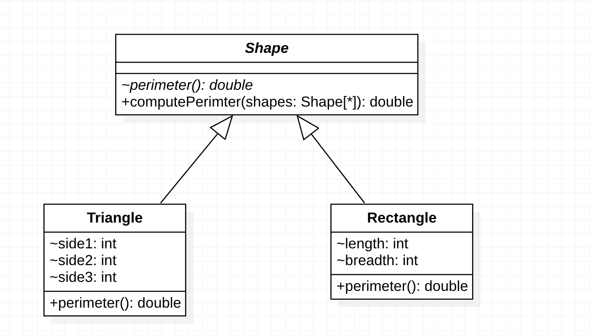
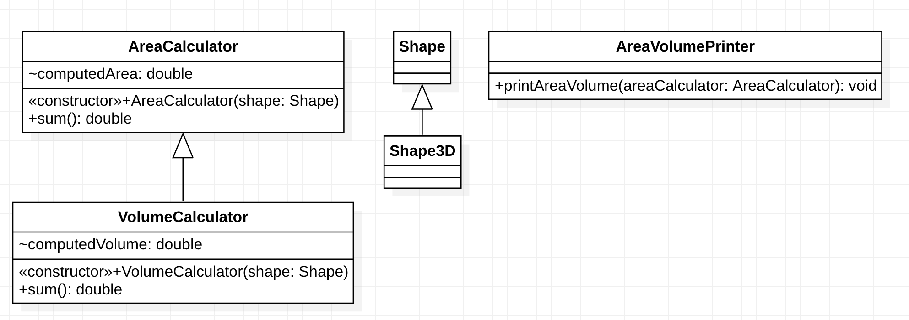
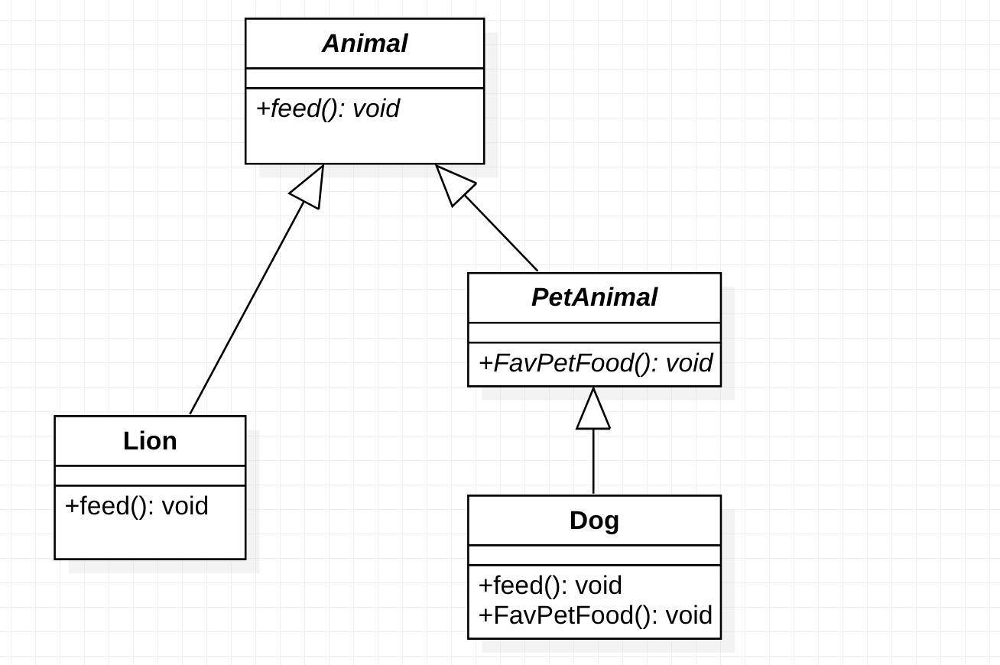
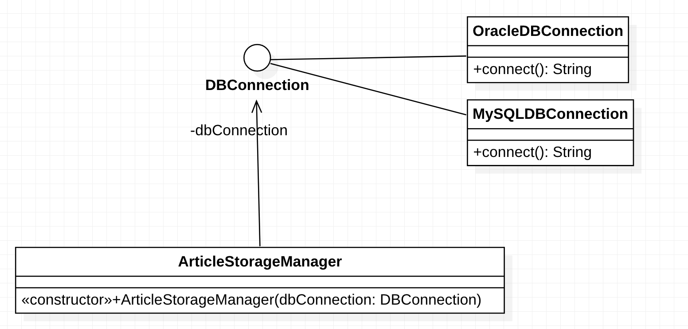

## S.O.L.I.D Principles - Illustrated by Examples

#### The Single-Responsibility Principle
There should never be more than one reason for a class to change. In other words, every class should have only one responsibility.

#### The Open–Closed Principle
Software entities (classes, modules, functions, etc.) should be open for extension, but closed for modification.

#### The Liskov Substitution Principle
Functions that use pointers or references to base classes must be able to use objects of derived classes without knowing it. For instance, if S is a subtype of T, then objects of type T may be replaced with objects of type S (i.e., an object of type T may be substituted with any object of a subtype S) without altering any of the desirable properties of the program.

#### The Interface Segregation Principle
The interface-segregation principle states that no client should be forced to depend on methods it does not use. Many client-specific interfaces are better than one general-purpose interface.

#### The Dependency Inversion Principle
Depend upon abstractions, not concretions. The principle states:
- High-level modules should not depend on low-level modules. Both should depend on abstractions (e.g., interfaces).
- Abstractions should not depend on details. Details (concrete implementations) should depend on abstractions.

